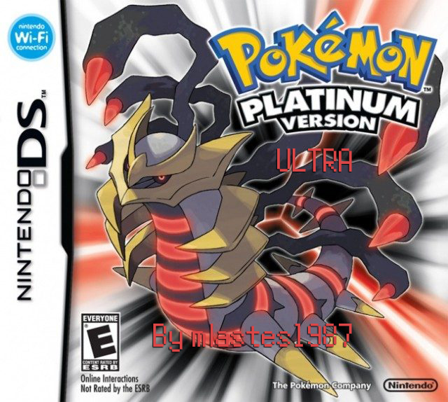

# Platinum Ultra

Based on the [**pokeplatinum**](https://github.com/pret/pokeplatinum) disassembly by pret.

# Features Currently Implemented:

- **Different Starters:** Starters are now changed to Bulbasaur, Torchic and Totodile.

- **Moveset Changes:** Movesets are changed for the new starters and others for solo and line challenge runs.

- **Pokemart/Item Changes:** Rare Candies, Master Balls and PP Max are now free and can be bought from the pokemart.

- **Trade Evolutions:** Trade Evolutions (Machoke, Graveler, Haunter, Kadabra, etc.) evolve at lvl 37 and other mon's hold evolution items can be used from the bag. (i.e. King's Rock for Politoed, Upgrade for Porygon 2)

Coming soon...
