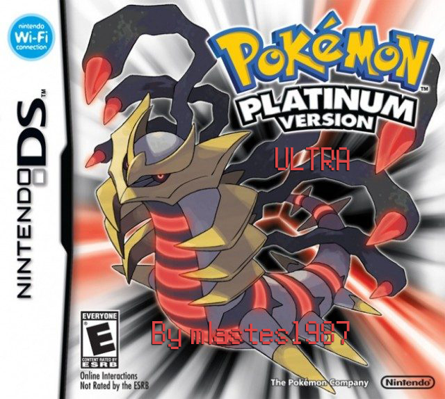

# Platinum Ultra

Based on the [**pokeplatinum**](https://github.com/pret/pokeplatinum) disassembly by pret.

# Features Currently Implemented:

- **Different Starters:** Starters are now changed to Bulbasaur, Torchic and Totodile.
- **Pokemart/Item Changes:** Rare Candies, Master Balls and PP Max are now free and can be bought from the pokemart.
- **Trade Evolutions:** Trade Evolutions (Machoke, Graveler, Haunter, Kadabra, etc.) evolve at lvl 37 and by using other mon's hold evolution items from the bag.

Coming soon...
